# XSD Generator

SAP PO/IS 환경에서 사용하는 **DataType(XSD)** 구조체를  
GUI 기반으로 빠르고 안정적으로 생성할 수 있도록 만든 **Java Swing Application** 입니다.

 

## ✨ 목적

- 반복적이고 오류가 발생하기 쉬운 XSD DataType 생성 과정을 **GUI로 단순화**
- 필드 입력만으로 **Level / Occurrence / Attribute** 등을 자동 규칙 기반 설정
- 생성된 XSD를 **즉시 파일로 저장**하여 SAP PO/IS에 바로 활용 가능

 

---

## 📌 전체 흐름

XSD Generator 는 3단계 흐름으로 구성되어 있습니다.

### 1) Definition — 데이터 타입 정의

> 데이터타입의 골격 정보 선언

- DataType Name
- Namespace
- XSD 파일 저장 경로
- 데이터타입 필드 명세 입력
- 각 필드 description 입력

_Screenshot_
> 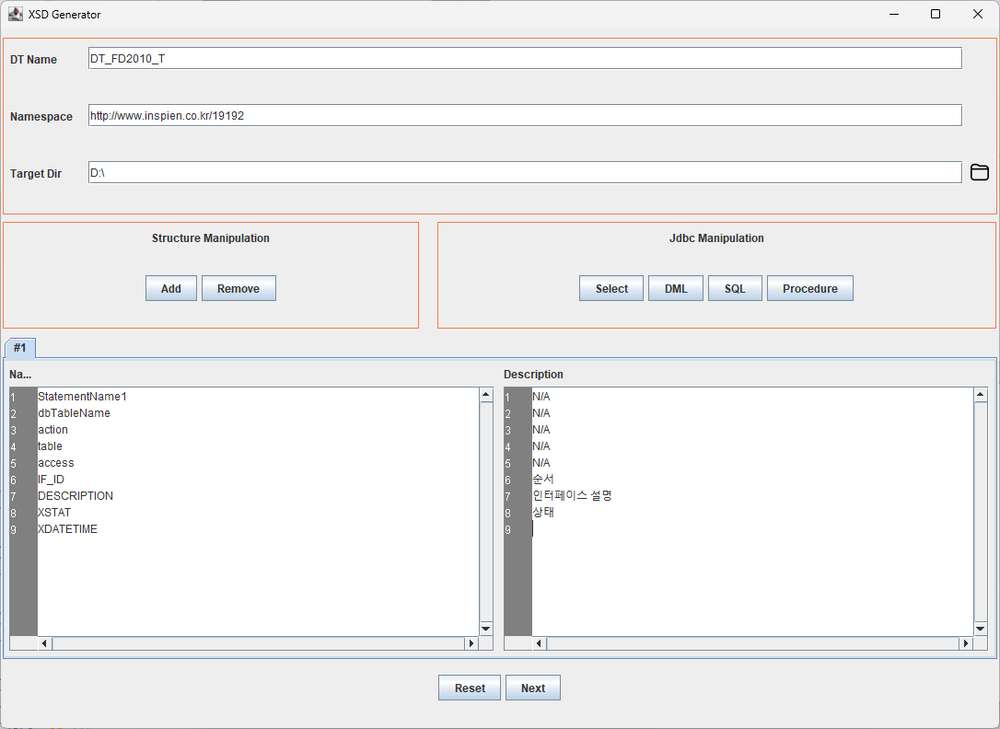

> 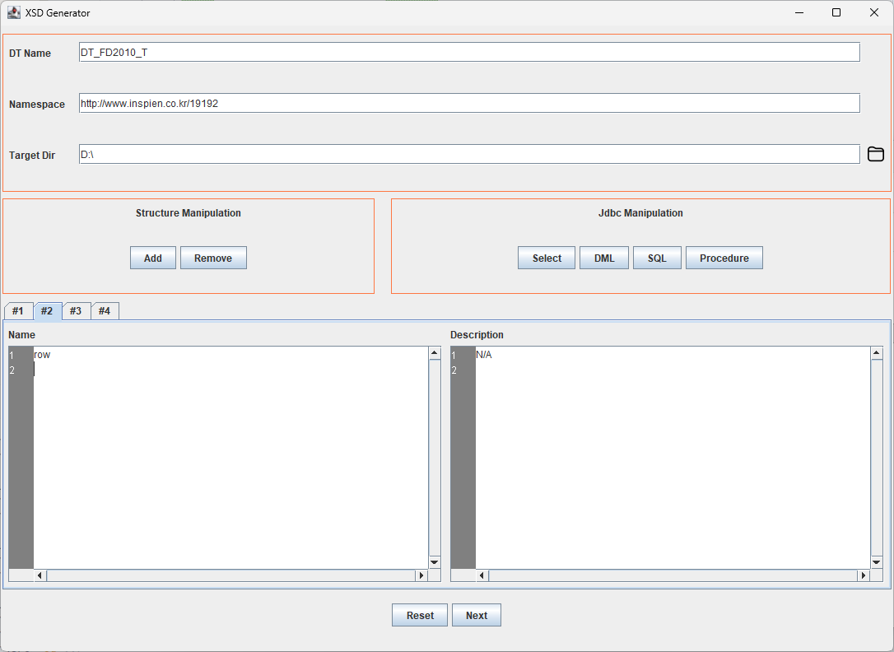
> 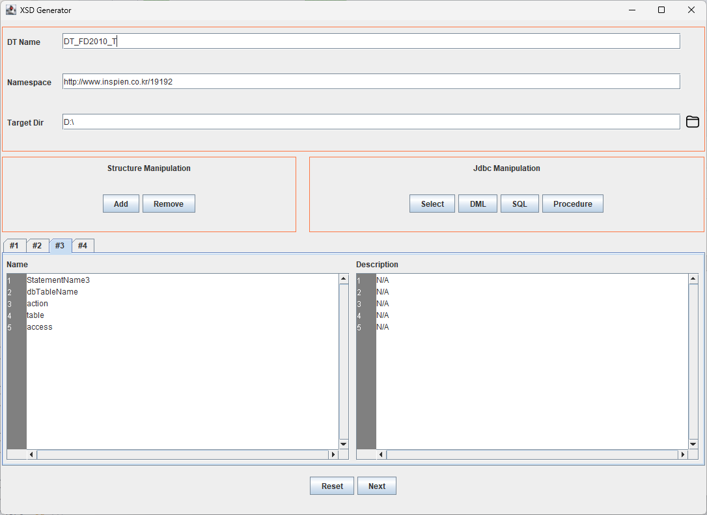
> 
> 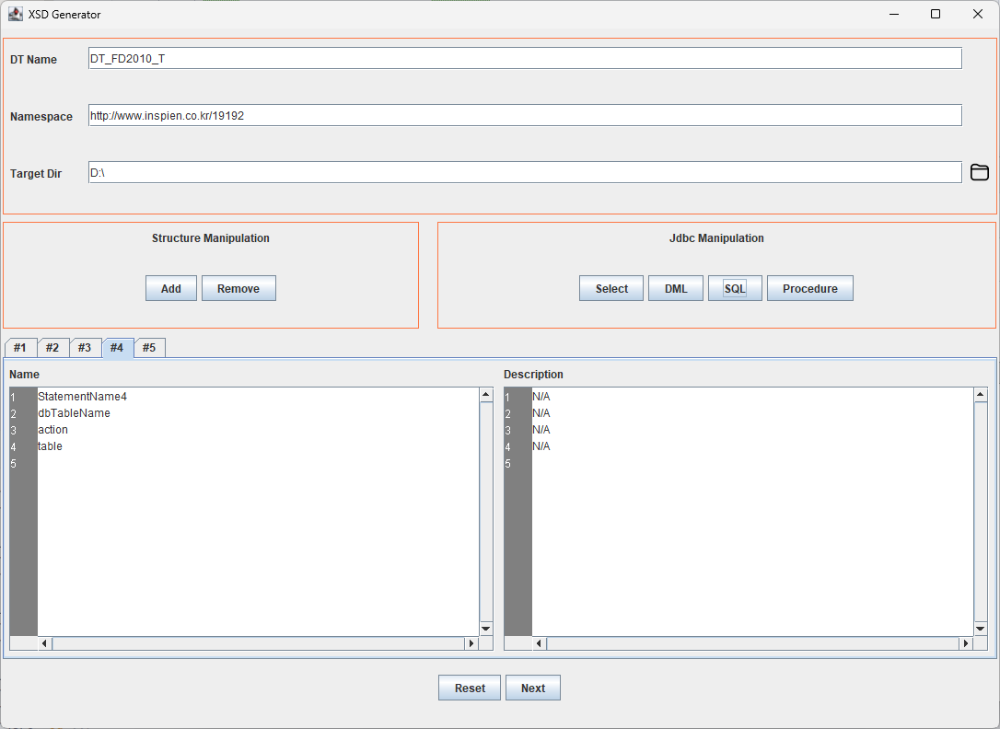

 

### 2) Specification — 필드별 세부 스펙 정의

> 각 필드 단위로 속성 제어 및 자동 규칙 적용

- `Attribute` 타입(isAction)은 다른 attribute를 가질 수 없도록 강제
- 각 필드별 기본 속성 제공
    - `hasQuot`
    - `isInput`
    - `isOutput`
    - 그 외 필드 속성 수정 가능
- 필드 정보를 기반으로 **Level / Occurrence 자동 설정**
    - StatementName = Level 1
    - dbTableName = Level 2
    - access / key / table / action = Level 3
    - 기타 필드 = Level 4~5 자동 배치
- Hierarchy 단계에서 재조정 가능

_Screenshot_
> 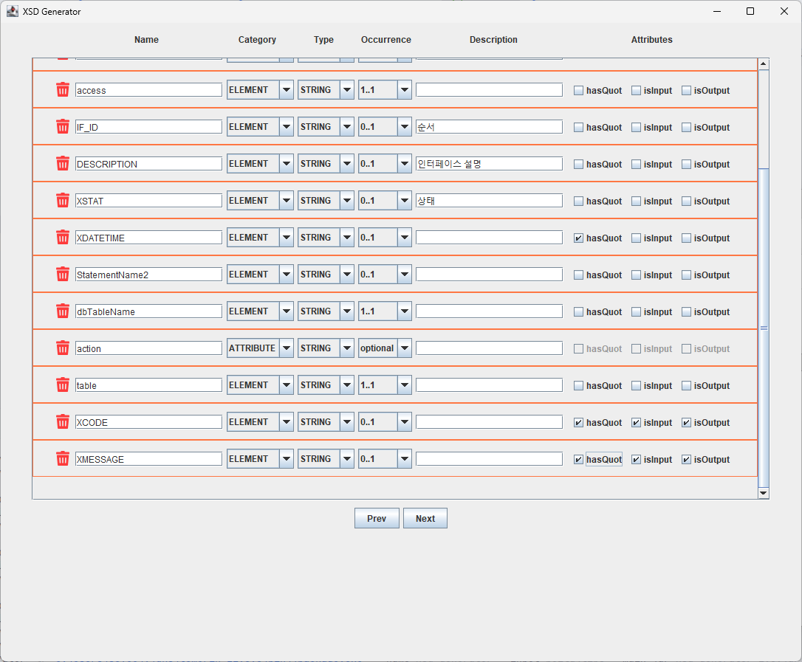

 

### 3) Hierarchy — 구조 계층 조절

> 자동 생성된 Level 구조를 재배치하여 원하는 형태로 조정

- EditMode 활성화 후 구조 변경 가능
- 좌클릭으로 이동시킬 데이터타입 선택 (FocusedDT 하단에 선택한 타입 표시)
- 우클릭으로 옮길 위치 데이터타입 선택 (추가방식: 부모-자식 / 형제 관계)
  - 부모-자식: 우클릭 타입 자식 노드로 추가됨
  - 형제     : 우클릭 타입의 동생 노드로 추가됨
- Specification 단계의 자동결과를 override 가능
- 최종 구조를 기준으로 XSD export 수행 (Complete 버튼)

_Screenshot_
> 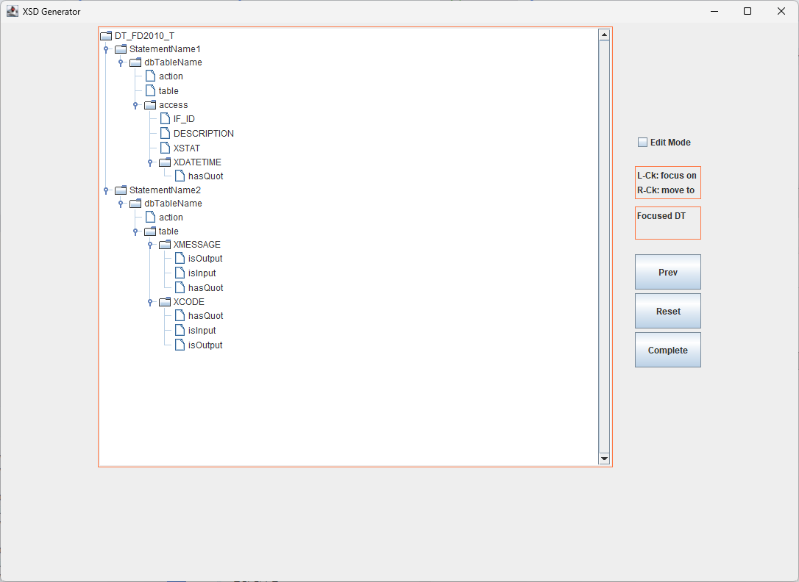

> 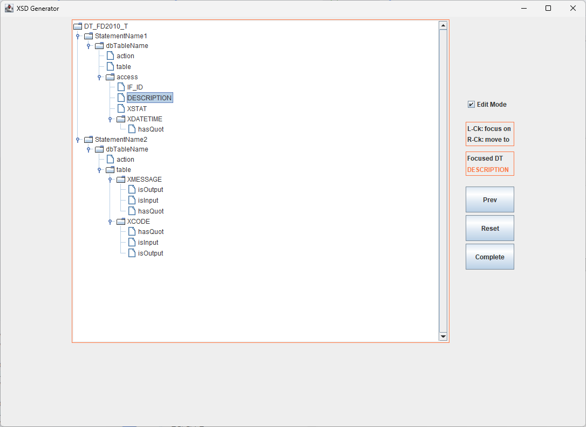
> 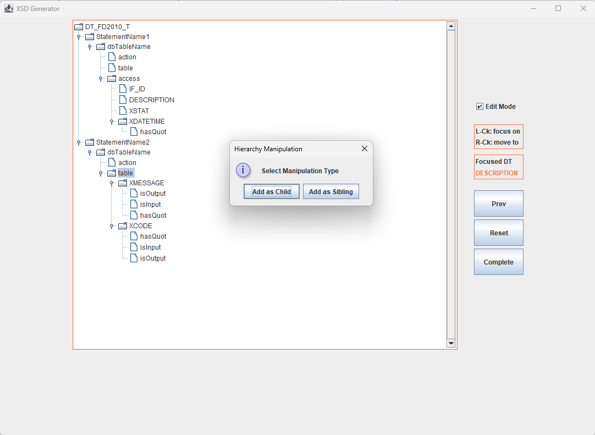
> 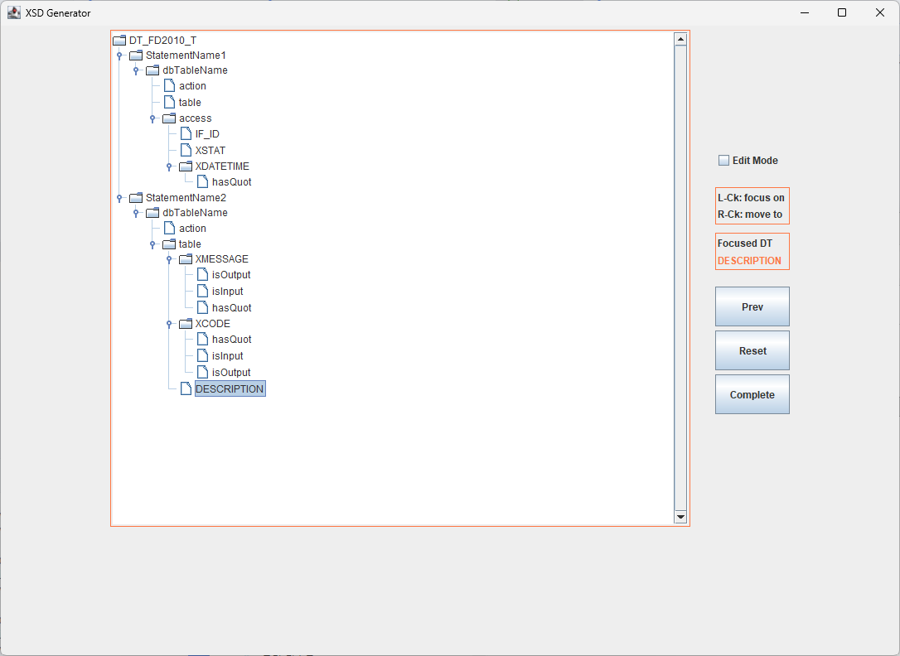

 

### 4) PO Result - 결과 확인

> 생성된 XSD 파일의 PO 인식 여부 확인

_Screenshot_
> 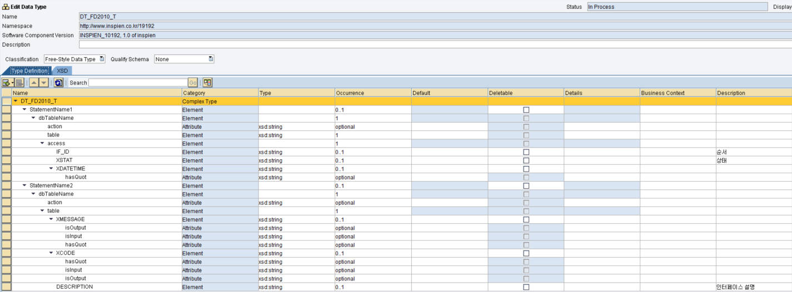

> 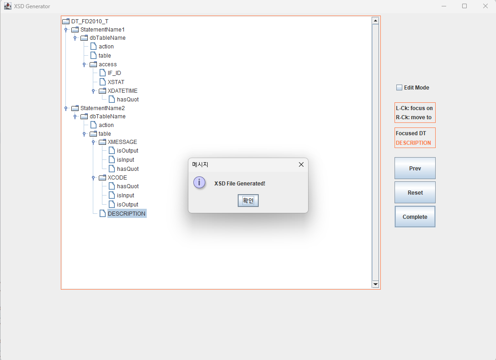

---

## 🧩 주요 기능 요약

| 기능 | 설명 |
|------|------|
| 자동 Level 지정 | 필드명 패턴 규칙 기반으로 계층/레벨 자동 배치 |
| Attribute Validation | action(Attribute) 필드에 대한 속성 제한 |
| XSD Export | 정의된 구조를 XSD 파일로 저장 |
| Hierarchy Override | 자동 배치 결과를 사용자 의도대로 보정 |

 

---

## 🏗 기술 스택

- Java 21
- Swing (UI)
- Gradle
- Launch4j / jpackage (배포예정)
- XSD Schema Generator (Custom)

 

---

## 📂 향후 계획

- PO Integration 서비스 직접 호출 연동
- XSL Mapping Template 자동 스캐폴딩
- 사용자 정의 규칙 Persistence

 

---

## 📜 License

This project is currently in private development.  
License will be specified when open-sourced.

---

## Author

**박세영 (Seyoung Park)**
> SAP PO Integration Engineer / Java Backend Developer

