# XSD Generator

SAP PO/IS 환경에서 사용하는 **DataType(XSD)** 구조체를  
GUI 기반으로 빠르고 안정적으로 생성할 수 있도록 만든 **Java Swing Application** 입니다.

<br>

## ✨ 목적

- 반복적이고 오류가 발생하기 쉬운 XSD DataType 생성 과정을 **GUI로 단순화**
- 필드 입력만으로 **Level / Occurrence / Attribute** 등을 자동 규칙 기반 설정
- 생성된 XSD를 **즉시 파일로 저장**하여 SAP PO/IS에 바로 활용 가능

<br>

---

## 📌 전체 흐름

XSD Generator 는 3단계 흐름으로 구성되어 있습니다.

### 1) Definition — 데이터 타입 정의

> 데이터타입의 골격 정보 선언

- DataType Name
- Namespace
- XSD 파일 저장 경로
- 데이터타입 필드 명세 입력
- 각 필드 description 입력

_Screenshot_
> 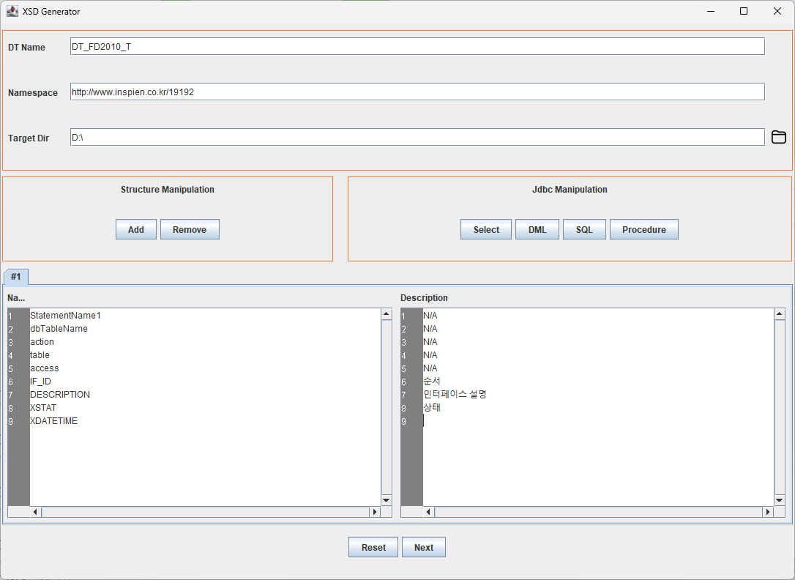
<details>

> 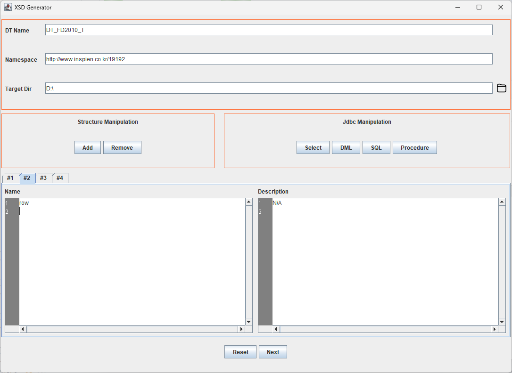
> 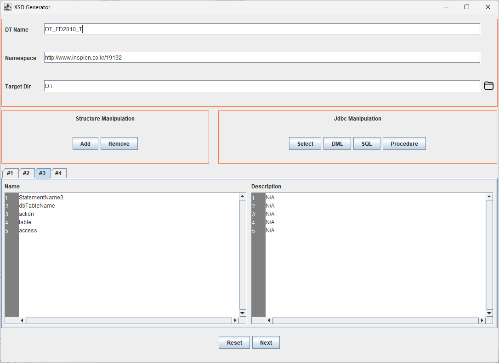
> 
> 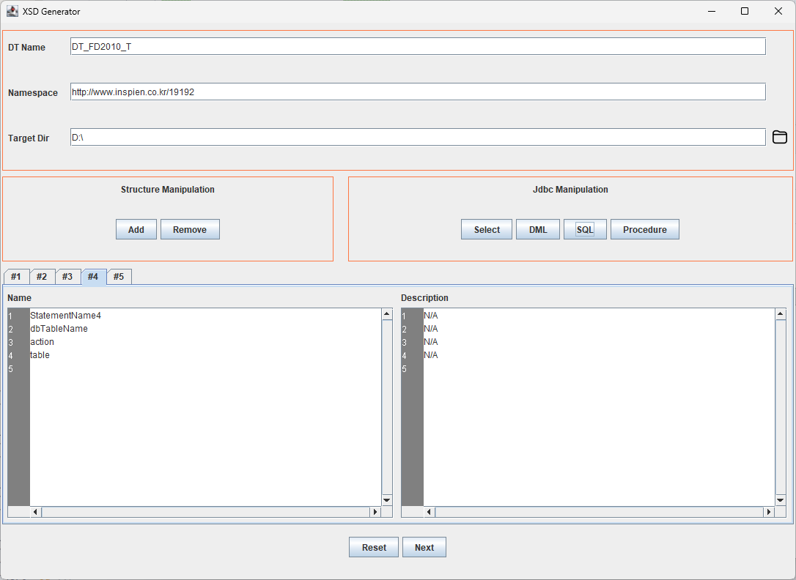

</details>

<br>

### 2) Specification — 필드별 세부 스펙 정의

> 각 필드 단위로 속성 제어 및 자동 규칙 적용

- `action` 필드는 체크박스 형태의 속성(hasQuot/isInput/isOutput) 목록에서 제외됨(UI에서 강제로 막는 것은 아니며, action 외 속성이 함께 있는지에 따라 XSD 생성 시 태그 구조가 달라짐)
- 각 필드별 기본 속성 제공
    - `hasQuot`
    - `isInput`
    - `isOutput`
    - 그 외 필드 속성 수정 가능
- 필드 정보를 기반으로 **Level / Occurrence 자동 설정**
    - StatementName = Level 1
    - dbTableName = Level 2
    - access / key / table / action = Level 3
    - 기타 필드 = Level 4~5 자동 배치
- Hierarchy 단계에서 재조정 가능

_Screenshot_
> 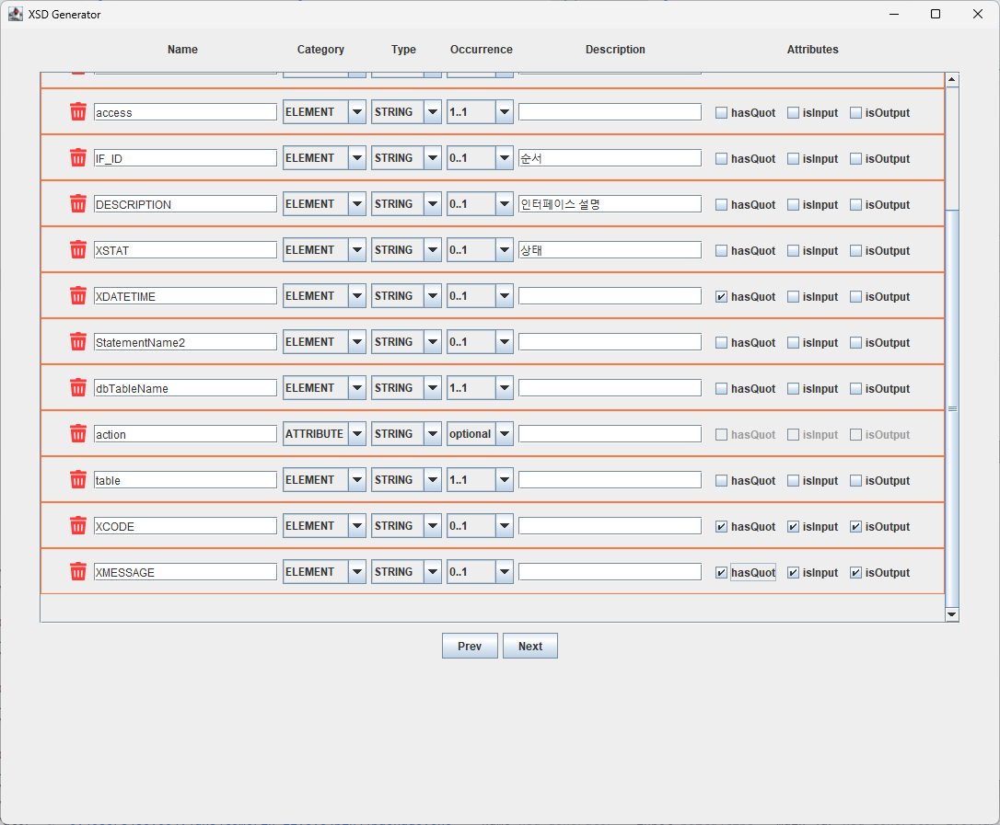

<br>

### 3) Hierarchy — 구조 계층 조절

> 자동 생성된 Level 구조를 재배치하여 원하는 형태로 조정

- EditMode 활성화 후 구조 변경 가능
- 좌클릭으로 이동시킬 데이터타입 선택 (FocusedDT 하단에 선택한 타입 표시)
- 우클릭으로 옮길 위치 데이터타입 선택 (추가방식: 부모-자식 / 형제 관계)
    - 부모-자식: 우클릭 타입 자식 노드로 추가됨
    - 형제     : 우클릭 타입의 동생 노드로 추가됨
- Specification 단계의 자동결과를 override 가능
- 최종 구조를 기준으로 XSD export 수행 (Complete 버튼)

_Screenshot_
> 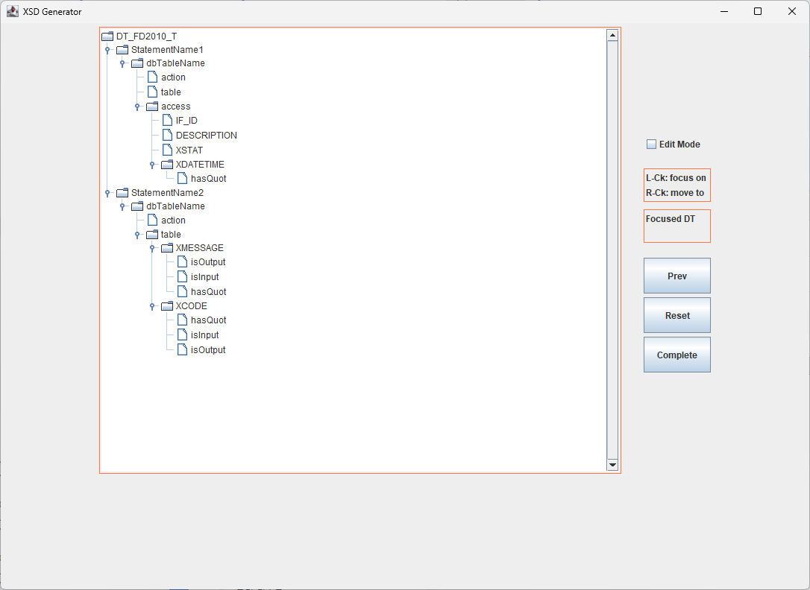

<details>

> 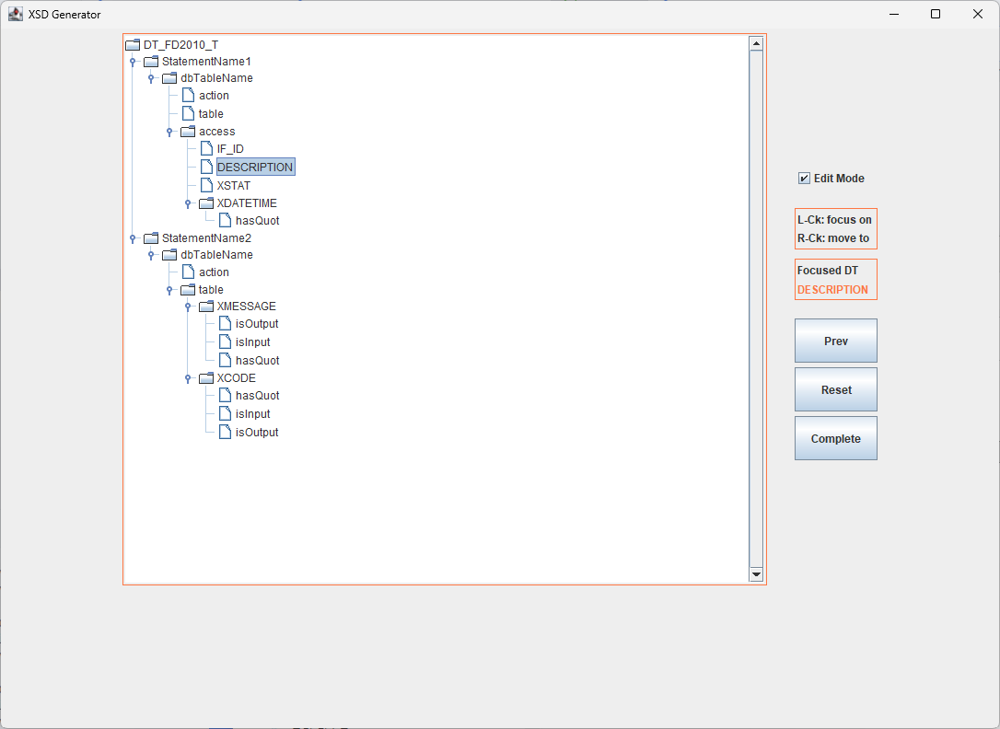
> 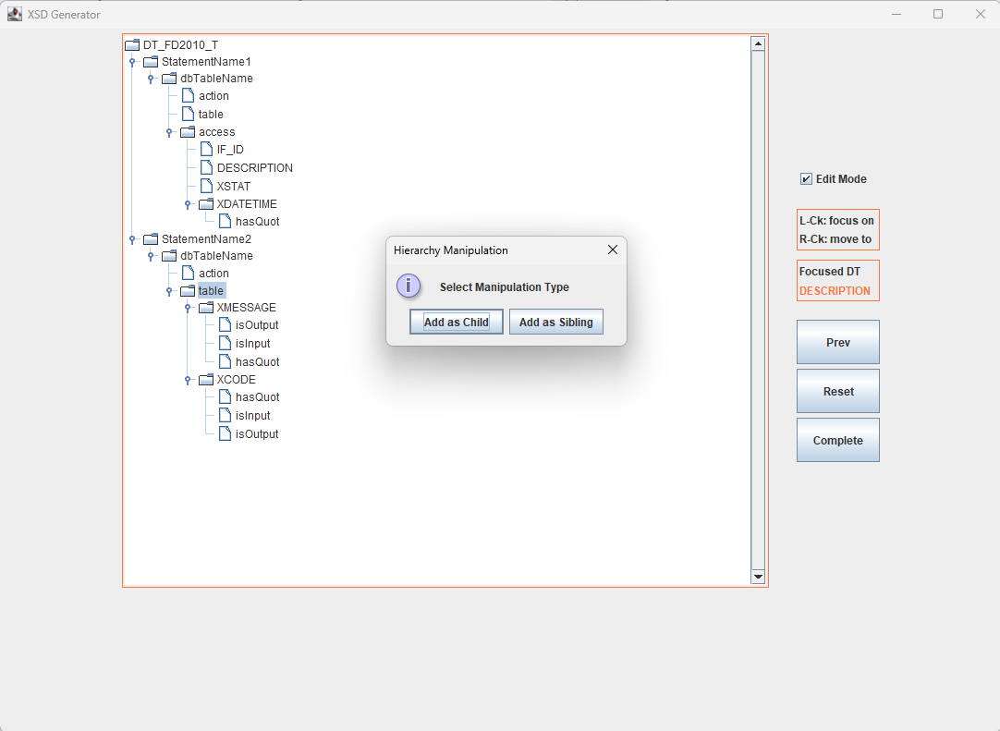
> 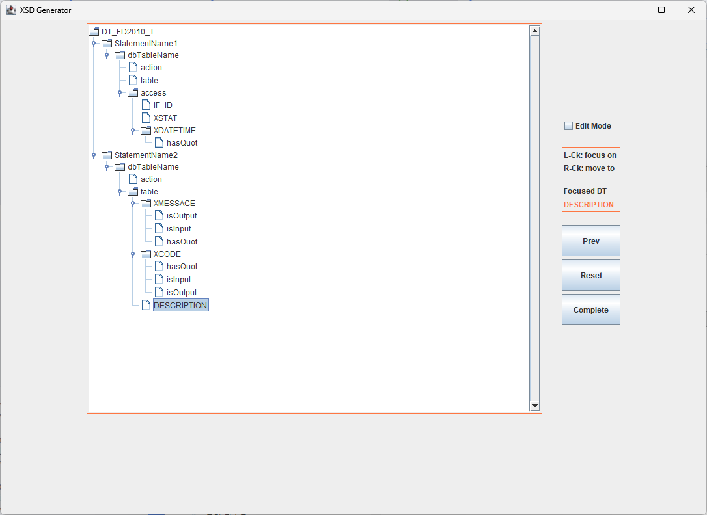

</details>

<br>

### 4) PO Result - 결과 확인

> 생성된 XSD 파일의 PO 인식 여부 확인

_Screenshot_
> 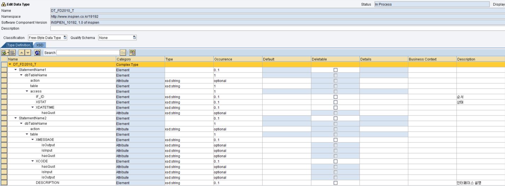

<details>

> 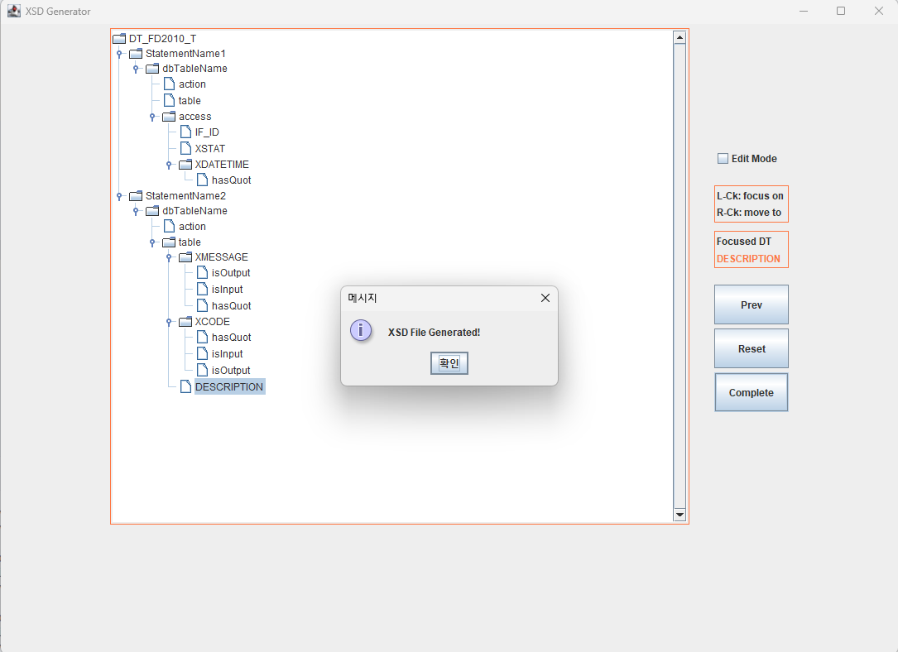

</details>

---

## 🧩 주요 기능 요약

| 기능                   | 설명                             |
|----------------------|--------------------------------|
| 자동 Level 지정          | 필드명 패턴 규칙 기반으로 계층/레벨 자동 배치     |
| Attribute Validation | action(Attribute) 필드에 대한 속성 제한 |
| Attribute 설정         | 필드 속성 설정 편의성 강화                |
| XSD Export           | 정의된 구조를 XSD 파일로 저장             |
| Hierarchy Override   | 자동 배치 결과를 사용자 의도대로 보정          |

<br>

---

## 🏗 기술 스택

- Java 21
- Swing (UI)
- Gradle
- jlink · jpackage (런타임 내장 단일 exe)

<br>

---

## 📦 빌드 / 배포

```powershell
.\build.ps1
```

`dist\xsd_generator-<version>.exe` **파일 하나**가 만들어진다. 설치 과정이나 별도의 `app`,
`runtime` 폴더 없이 이 exe 하나만 복사해서 실행하면 되고, 대상 PC 에 Java 가 설치되어 있지
않아도 동작한다.

빌드 단계는 다음과 같다.

1. `gradlew jar` — 애플리케이션 jar 생성
2. `jdeps` — 실제로 사용하는 JDK 모듈 산출 (현재 `java.base`, `java.desktop`)
3. `jlink` — 해당 모듈만 담은 최소 런타임 생성 (전체 JDK 151MB → 46MB)
4. `jpackage --type app-image` — 런타임 + jar + 실행 파일 묶음 생성
5. 묶음을 zip 으로 압축 후 [`launcher/Launcher.cs`](launcher/Launcher.cs) 런처 exe 에 리소스로 내장

실행 시 런처는 내장된 zip 을 `%LOCALAPPDATA%\xsd_generator\<version>` 에 한 번만 풀고
애플리케이션을 띄운다. 최초 실행은 1~2초 정도 걸리며, 이후 실행은 곧바로 시작된다.
버전이 올라가면 이전 버전 캐시는 자동으로 정리된다.

> JDK 는 `JAVA_HOME`, `PATH`, `%USERPROFILE%\.jdks` 에서 `jpackage` 를 가진 것을 모두 모아 **가장 높은
> 버전**을 쓴다. `JAVA_HOME` 이 구버전을 가리켜도 문제가 없고, 특정 JDK 를 강제하려면
> `.\build.ps1 -JdkHome <경로>` 로 지정한다. JDK 21 미만이면 jlink 압축 옵션을 자동으로 낮춘다.
> 런처 컴파일에는 Windows 에 기본 포함된 .NET Framework 의 `csc.exe` 를 사용하므로
> 추가 설치가 필요 없다.

<br>

---

## 📜 License

open-sourced

---

## Author

**박세영 (Seyoung Park)**
> SAP PO Integration Engineer

